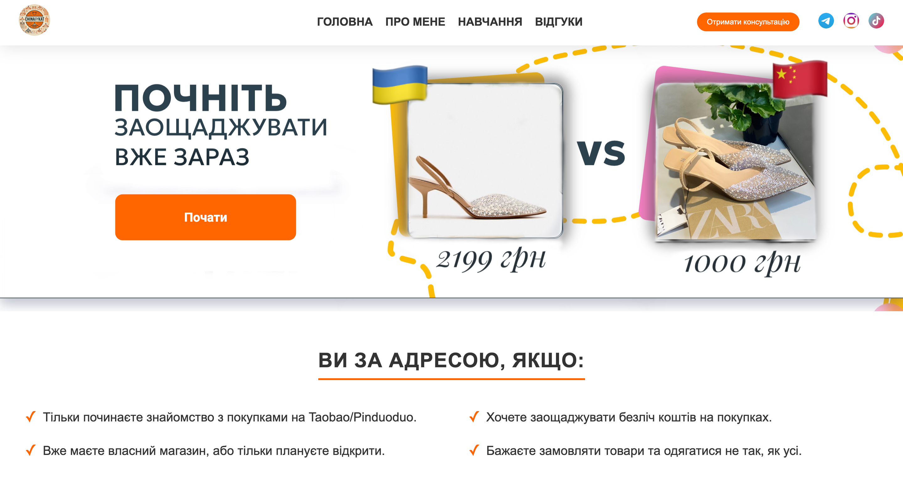

# 🌟 **Landing Page Project**

Welcome to the **Landing Page Project**! This project is a fully responsive landing page designed to showcase services or products in a modern, stylish, and interactive way.

### 🚀 **Features**
- **Responsive Design**: Optimized for both desktop and mobile views.
- **Smooth Animations**: Engaging animations that enhance user experience.
- **Interactive Elements**: Interactive components like forms, buttons, and dynamic content.
- **Customizable**: Easily customizable to fit any brand or product.
- **Telegram Integration**: The form submissions are sent directly to a Telegram bot for instant notifications.

### 💻 **Tech Stack**
- **Frontend**: HTML, CSS, JavaScript
- **Backend**: Python (FastAPI)
- **Tools**: Poetry, Uvicorn, Nginx, Certbot (for SSL)
- **Telegram Bot**: Used to send form submissions directly to a Telegram chat for easy access and notifications.

### 🌐 **Visit the Website**
You can view the website at [https://chinabykat.pp.ua](https://chinabykat.pp.ua)

### 📸 **Screenshots**

#### Homepage

Enjoy exploring the project! If you have any questions, feel free to open an issue on GitHub or contact me.
